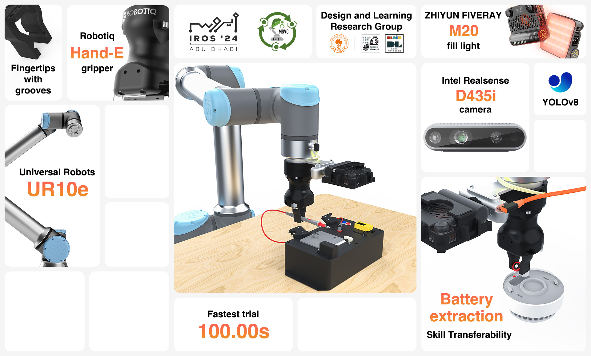

# Design & Learning Research Group Submission - euROBIN MSVC @ IROS 2024

[[Report Page]](https://msvc-dlrg.github.io) | [[Video]](https://youtu.be/6FlQ3zCi53w) | [[Data]](https://drive.google.com/drive/folders/1yhIDuubmL7S85B2c-S1hvZppHv4G-Wow?usp=sharing)



## Overview

This repository contains the code, and brief introduction of our approach used for [the euROBIN Manipulation Skill Versatility Challenge (MSVC)](https://sites.google.com/view/eurobin-msvc/) at [the 2024 IEEE/RSJ International Conference on Intelligent Robots and Systems (IROS 2024)](https://iros2024-abudhabi.org/). For more details, please refer to the [report page](https://msvc-dlrg.github.io).

## Hardware Setup

The robot system used in the competition consists of:

- Collebrative robot: [Universal Robots UR10e](https://www.universal-robots.com/products/ur10-robot/)
- Adaptive gripper: [Robotiq Hand-E](https://robotiq.com/products/adaptive-grippers#Hand-E)
- Fingertip: [3D-printed fingertip](https://cad.onshape.com/documents/43edc50e275c72eace7a4839)
- RGB-D Camera: [Intel RealSense D435i](https://www.intelrealsense.com/depth-camera-d435i/)
- Camera bracket: [CNC-milled camera bracket](https://cad.onshape.com/documents/01d4267b0af8aab9d6acb1ab)
- Fill light (Optional): [ZHIYUN FIVERAY M20](https://www.zhiyun-tech.com/en/product/detail/867)

And there is also the [task board](docs/task_board.pdf) and the [Hikvision NP-Y1-S smoke detector](https://detail.tmall.com/item.htm?id=654643896582) used as task objects.

## Software Dependencies

The repository is developed with C++ and Python, and tested on Ubuntu 20.04 with the following dependencies:

- [Real-time Data Exchange (RTDE)](https://www.universal-robots.com/articles/ur/interface-communication/real-time-data-exchange-rtde-guide/)
- [Intel RealSense SDK 2.0](https://www.intelrealsense.com/sdk-2/)
- [Rerun](https://rerun.io/)
- [YOLOv8](https://github.com/ultralytics/ultralytics)

## Quick Start

First, download the latest release:

```bash
git clone https://github.com/ancorasir/DesignLearnRG_euROBIN.git
cd DesignLearnRG_euROBIN
```

Then, install the Python dependencies:

```bash
pip install -r requirements.txt
```

There are three main components in the repository: vision detection, robot motion, and user interface. You need to run them together to complete the task.

### Vision Detection

To detect the task board and screen on it, a vision detector is provided in `./vision/`. To run the vision detector, run:

```bash
cd vision
mkdir build
cd build
cmake ..
cmake --build .
./main
```

The vision detector will output the detected objects' positions and orientations in the robot base frame.

### Robot Motion

The code for robot motion is provided in `./motion/`. To run the tasks in normal order, run:

```bash
cd motion
python scripts/execute_task.py
```

You can also modify the order of the tasks, changing the order of the task execution function. To modify the motions for a specific task, you can edit the task files in `./motion/tasks/`.


### User Interface

An interface is provided in `./interface/`, including 3D scene and curves, to visualize and record the robot data. You can also set the order of robot actions. To open the interface, run:

```bash
cd interface
python server.py
```

The interface will be available at `http://127.0.0.1:8000`.

## Data Availability

The data recorded during trials is available at [Google Drive](https://drive.google.com/drive/folders/1yhIDuubmL7S85B2c-S1hvZppHv4G-Wow?usp=sharing), which includes:

- [x] Positions and velocities of UR10e's joints
- [x] Trajectories of UR10e's tool center point (TCP)
- [x] Images captured by Intel Realsense D435i camera

All data is recorded at 10 Hz, and you can place it into `./data/` folder, and run the following code to visualize:

```bash
cd interface
python server.py -m log-data -d {DATA FOLDER NAME}
```

`{DATA FOLDER NAME}` is the folder name formatted with the time at which data recording started. For example, if you want to view the data in `./data/20240928-162531/`, `{DATA FOLDER NAME}` should be `20240928-162531`. After running the code, you can view the data at `http://127.0.0.1:8000`.

## License

This repository is released under the MIT License. See [LICENSE](LICENSE) for more information.
